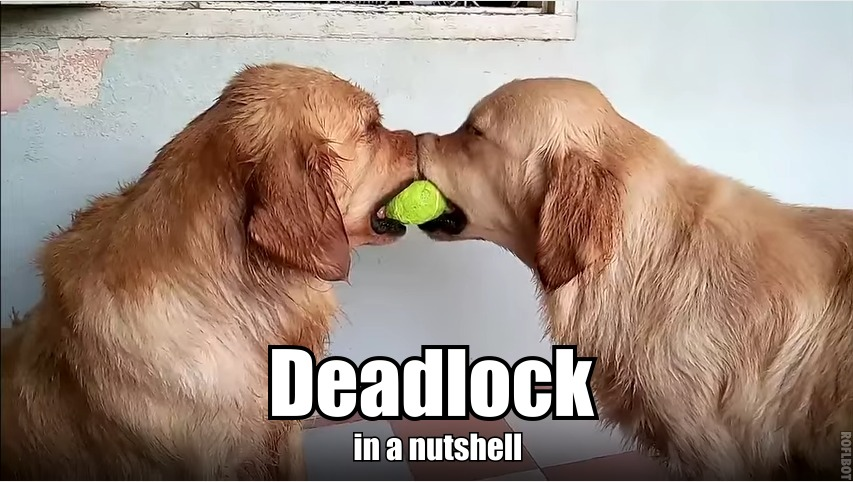
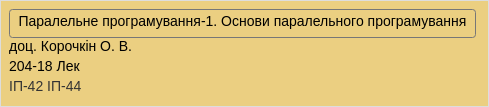
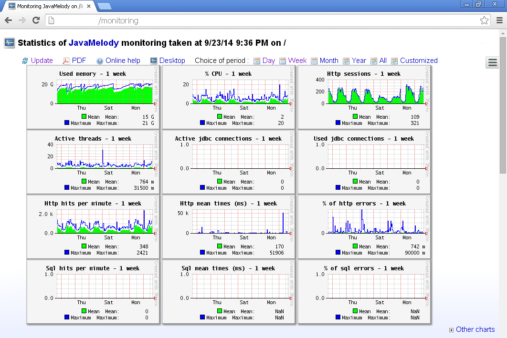

# Моніторинг та оптимізація
## Java-застосунків

_[@by_mamagaga](https://github.com/VladislavZavadsky)_, _[@anxolerd](https://github.com/anxolerd)_

21 грудня 2016

-----


-----

# Частина 1.
## Огляд типових проблем та способів їх оптимізації

-----



**Deadlock** — взаємне блокуваня, яке приводить до зависання програми.

>>>>>

## Типовий приклад

<div class="left">
<pre><code class="java"><!--
-->class T1 extends Thread {
   @Override
   public void run() {
       // ...
       lockA.lock();
       lockB.lock();
       // Critical section
       lockB.unlock();
       lockA.unlock();
       // ...
   }
}<!--
--></code></pre>
</div>

<div class="right">
<pre><code class="java"><!--
-->class T2 extends Thread {
   @Override
   public void run() {
       // ...
       lockB.lock();
       lockA.lock();
       // Critical section
       lockA.unlock();
       lockB.unlock();
       // ...
   }
}<!--
--></code></pre>
</div>

>>>>> 

## Як боротися з Deadlocks

<ul>
    <li class="fragment">Ретельно проектувати застосунок</li>
    <li class="fragment">Звертати особливу увагу на взаємодію потоків</li>
</ul>



-----

## Витоки пам'яті


**Memory leak** — процес неконтрольованого зменшення об'єму пам'яті комп'ютера, пов'язаний з помилками в програмах, 
які вчасно не звілняють вже не потрібні ділянки пам'яті.

>>>>>

### Створення об'єктів у циклі

```java
class InLoopCreator {
    public static void main(String[] args){
        // ... 
        for (Object o : collection) {
            // Note that a new checker instance
            // will be created on each iteration
            Checker c = new Checker();
            if (c.check(o)) {
                process(o);
            }
        }
        // ...
    }
}
```

Note: Винести створення `Checker` за цикл 

>>>>>

### Невикористання паттернів

```java
class DwarfNPC {
    byte[] texture; 
    // ...
    
    DwarfNPC() {
        // ...
    
        // Note that we load the same texture 
        // for every single instance
        this.texture = FileLoader.load("assets/textures/dwarf");
        
        // ...
    }
}
```

Note: [Flyweight pattern](https://en.wikipedia.org/wiki/Flyweight_pattern)

>>>>>

### Завантаження усього і одразу

```java
class GreedyLoader {
    List<World> worlds = new ArrayList<World>();
    
    GreedyLoader() {
        // ...
        for (String resourceUrl : resourceList) {
            World world = World.fromResource(resourceUrl);
            worlds.add(world);
        }
        // ...
    }
    
    // Worlds are used sequentially
    public World getNextWorld() { /* ... */ }
    
}
```

Note: Всі світи одразу не потрібні. Можна завантажувати їх при зміні

>>>>>

### Невивантаження ресурсів

```java
class HeavyTaskProcessor {
    Resources resources;
    
    void processWithResources() {
        resources = load(resources);
        // Do processing
    }
    
    void processWithoutResources1() {}
    void processWithoutResources2() {}
    void processWithoutResources3() {}
    void processWithoutResources4() {}
    
    // ...
}
```

Note: Ресурси потрібні лише для `processWithResources` і ніде не вивантажуються

-----

## Важкі SQL-запити


>>>>>

### Очікування

```sql
-- Easy
SELECT * FROM "user" WHERE id = 42;

-- Normal
SELECT boss.*
FROM "user"
  JOIN "user" AS boss ON boss.id = "user".boss_id
WHERE "user".role = 'employee';
```

>>>>>

### Реальність

```sql
SELECT cl.* FROM client cl
  JOIN company ON cl.company_id = cl.id
  JOIN service_record sr ON sr.company_id = company.id
  JOIN binding_record br ON br.client_id = cl.ud
WHERE br.valid_since < now() - INTERVAL '42 days'
  AND (sr.invoice_id IS NULL OR sr.upgrade_invoice_id IS NULL)
  AND sr.id IN (SELECT id FROM services WHERE price > 0)
  AND NOT EXISTS (
    SELECT 1 FROM binding_record br2
    WHERE br2.valid_since > br.valid_since
      AND br2.client_id = br.client_id
      AND br2.status IN (1,2,5,6)
  )
```

>>>>>

### Стратегії вирішення

<ul>
  <li class="fragment">Проходити по базі частинами</li>
  <li class="fragment">Розбити запит на декілька менших</li>
  <li class="fragment">Виконувати фільтрацію на стороні застосунку</li>
  <li class="fragment">Оптимізовувати сам запит</li>
</ul>

>>>>>

#### Проходити по базі частинами

```java
String q = "select * from big_table";
// ...
ResultSet rs = stmt.executeQuery(q);
process(rs);
```

```java
String q = "select * from big_table limit=? offset=?";
PreparedStatement st = con.prepareStatement(q);

while (true) {
    st.setLong(0, limitValue);
    st.setLong(1, offsetValue);

    ResultSet rs = stmt.executeQuery(q);
    if (rs.isBeforeFirst()) { // result is not empty
        process(rs);
        offsetValue = offsetValue + limitValue;
    } else {
        break;
    }
}
```

>>>>>

#### Розбити запит на декілька менших

```sql
SELECT * FROM table_name
WHERE
   (table_name.column1 = 'group1' and table_name.some_value > 10)
   or (
       table_name.column1 = 'group2'
       and table_name.some_value < 2
       and table_name.some_other_value > 13
   )
;
```

```sql
-- QUERY 1
SELECT * FROM table_name
WHERE table_name.column1 = 'group1'
  AND table_name.some_value > 10;

-- QUERY 2
SELECT * FROM table_name
WHERE table_name.column1 = 'group2'
  AND table_name.some_value < 2
  AND table_name.some_other_value > 13;
```

>>>>>

#### Виконати фільтрацію на стороні застосунку

```java
String q = "SELECT * FROM table_name WHERE column1 > 42";
ResultSet rs = conn.executeQuery(q);
List<Entity> alist = parseRs(rs);
for (Entity item : alist) {
    if (!someCondition(item)) { continue; }
    process(item);
}
```

>>>>>

#### Оптимізувати запит

<ul>
  <li class="fragment">Використоувати індекси</li>
  <li class="fragment">UNION ALL замість складних OR</li>
  <li class="fragment">Зменшувати вибірку за допомогою CTE</li>
</ul>

-----

# Частина 2.
## Моніторинг застосунків

-----

## JMX

>>>>>

**Java Management Extensions (JMX)** — технологія Java, що призначена для контролю та керування
застосунками, системними об'єктами, пристроями (напр. принтерами) та
комп'ютерними мережами.
Дані ресурси представляються у вигляді MBean-об'єктів (Managed Bean)

>>>>>


>>>>>


>>>>>


>>>>>

### Демо

-----

## JMC

>>>>>

**Java Mission Control (JMC)** — набір утиліт для керування, моніторингу та профілювання Java-застосунків.
 Входить до складу Oracle JDK з версії 7u40. Складається із JMX консолі та Java Flight Recorder 

>>>>>

### Демо

>>>>>

### Корисні посилання

- [Офіційна сторінка](http://www.oracle.com/technetwork/java/javaseproducts/mission-control/java-mission-control-1998576.html)
- [Демонстрація можливостей JMC](https://youtu.be/qytuEgVmhsI)
- [Вступ до Java Mission Control](https://youtu.be/WMEpRUgp9Y4)

-----

## Logs (ELK)

>>>>>


- Elasticsearch
- Logstash
- Kibana

>>>>>

### Демо

[Public Kibana instance](http://demo.elastic.co/)

>>>>>

### Корисні посилання

- [OSDN2016 - TARAS FILIPOV - СОВРЕМЕННЫЕ СРЕДСТВА АНАЛИЗА ЛОГОВ](https://youtu.be/lppeaIgVpqQ)
- [Встановлення ELK стеку](https://www.digitalocean.com/community/tutorials/how-to-install-elasticsearch-logstash-and-kibana-elk-stack-on-ubuntu-14-04)

-----

## Java Melody

>>>>>

https://github.com/javamelody/javamelody/wiki


>>>>>

### Демо

-----

# Дякуємо, що дослухали до кінця)

>>>>>


