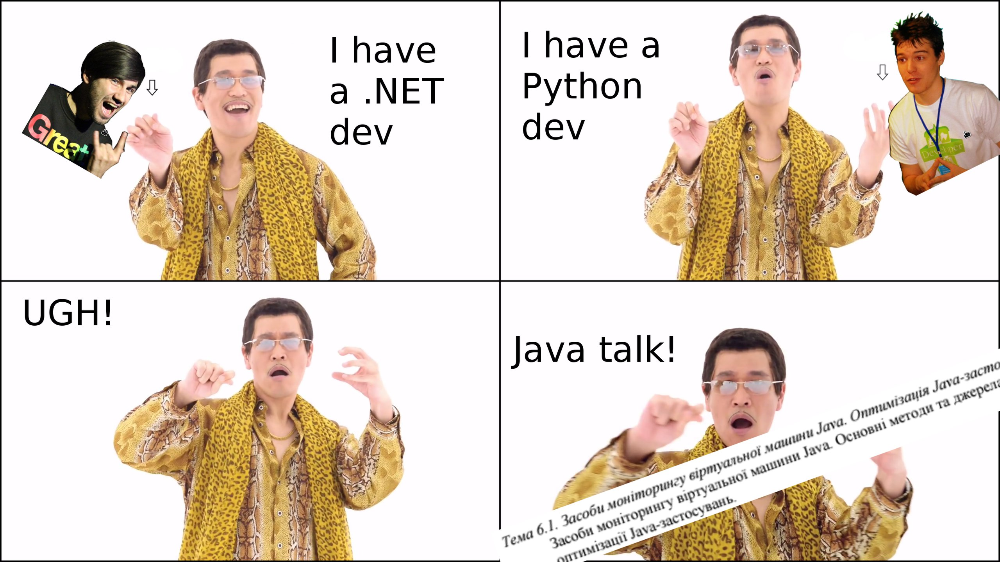
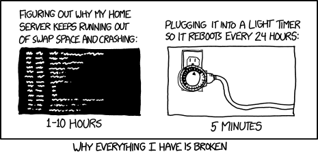
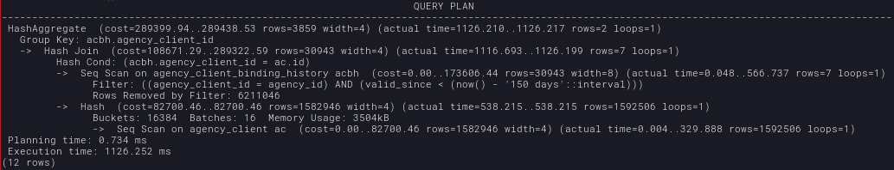
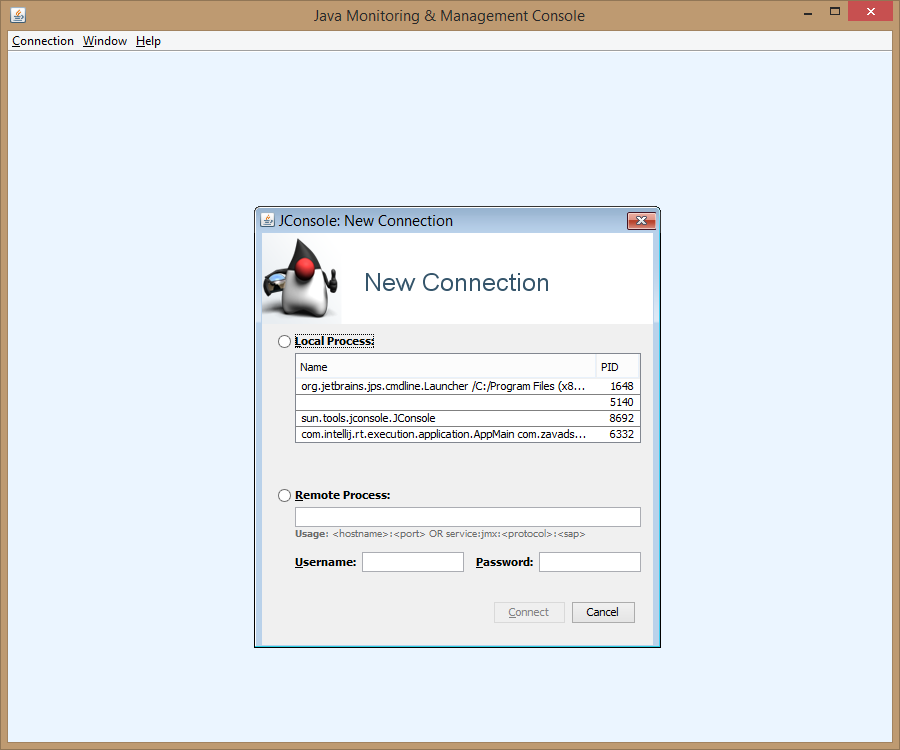
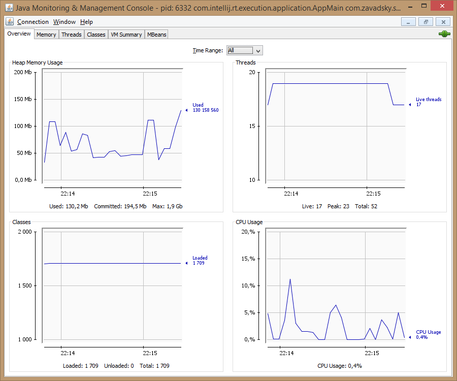
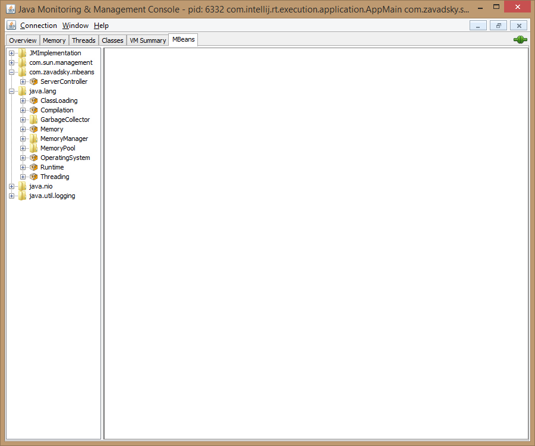

## Monitoring and optimization
### of Java applications

_[@by_mamagaga](https://github.com/VladislavZavadsky)_, _[@anxolerd](https://github.com/anxolerd)_

Dec 14 2016

-----



-----


DEADLOCK - взаємне блокуваня, яке приводить до зависання програми.

>>>>>

## Example in SQL
```SQL
--Transaction #1
BEGIN;
/* GET S LOCK */
SELECT * FROM `testlock` WHERE id=1 LOCK IN SHARE MODE;
SELECT SLEEP(5);
/* TRY TO GET X LOCK */
SELECT * FROM `testlock` WHERE id=1 FOR UPDATE;
COMMIT;

--Transaction #2
BEGIN;
/* TRY TO GET X LOCK - DEADLOCK AND ROLLBACK HERE */
SELECT * FROM `testlock` WHERE id=1 FOR UPDATE;
COMMIT;
```
>>>>>
## Example in Java

```java
public class TestMain {
  public static void main(String[] args) {
    MyThreadOne t1 = new MyThreadOne();
    MyThreadTwo t2 = new MyThreadTwo();

    t1.setThread2(t2);
    t2.setThread1(t1);
    t1.start();
    t2.start();
  }
}
```
>>>>>

<div id="left">
<H6 align="center">THREAD #1</H6>
<pre>
<code class="java">
public class MyThreadOne extends Thread {
  Thread t2;

  public void run() {
    try {
    sleep(1000);
    } catch (Exception e) {  }
    try {
      t2.join(); // Wait for thread #2
    } catch (Exception e) {
        // handle
    }
  }

  public void setThread2(Thread t) {
  this.t2 = t;
  }
}
</code></pre>

</div>
<div id="right">
<H6 align="center">THREAD #2</H6>
<pre>
<code class="java">
public class MyThreadTwo extends Thread {
  Thread t1;

  public void run() {
    try {
    t1.join(); // Wait for thread #1
    } catch (Exception e) { }
    try {
      sleep(1000);
    } catch (Exception e) {
      // handle
    }
  }

  public void setThread1(Thread t) {
  this.t1 = t;
  }
}
</code></pre>

</div>
-----

## Memory leak


>>>>>

Memory leak - процес не контрольованого зменшення об'єму вільної оперативної або віртуальної пам'яті комп'ютера, пов'язаний з помилками в працьюючих програмах, які вчасно не звілняють вже не потрібні ділянки пам'яті.

>>>>>

## Example

```java
1. Object obj;
2. obj = new AnotherObject();
3. obj = null;
4. obj = new AnotherObject();
```

-----

## Пам'ять в Java. Купа

>>>>>

В Java пам'ять поділяється на 2 ділянки:
<ul>
  <li class="fragment">Стек (для кожного потоку свій окремо)</li>
  <!-- <li class="fragment"><s>💩</s></li> -->
  <li class="fragment">Купа</li>  
</ul>

>>>>>


-----

## Garbage Collection

>>>>>

Garbage Collection (Механізм сбору сміття) - це процес звільнення місця в купі, для можливості додавання нових об'євтів.

-----

## SQL-запити


>>>>>

## Очікування

```sql
-- Easy
SELECT * FROM "user" WHERE id = 42;

-- Normal
SELECT boss.*
FROM "user"
  JOIN "user" AS boss ON boss.id = "user".boss_id
WHERE "user".role = 'employee';
```

>>>>>

## Реальність

```sql
SELECT client.*
FROM client
  JOIN company ON client.company_id = company.id
  JOIN service_record ON service_record.company_id = company.id
  JOIN binding_record ON binding_record.client_id = client.ud
WHERE binding_record.valid_since < now() - INTERVAL '42 days'
  AND (
    service_record.invoice_id IS NULL
    OR service_record.upgrade_from_invoice_id IS NULL
  )
  AND service_record.id IN (
    SELECT id FROM services WHERE price > 0
  )
  AND NOT EXISTS (
    SELECT 1
    FROM binding_record br2
    WHERE br2.valid_since > binding_record.valid_since
      AND br2.client_id = binding_record.client_id
      AND br2.status IN (1,2,5,6)
  )
```

>>>>>

## EXPLAIN

Переглянути план виконання запиту і знайти критичні місця

```sql
EXPLAIN ANALYZE
select distinct agency_client_id
from agency_client_binding_history acbh
join agency_client ac on ac.id = acbh.agency_client_id
where acbh.agency_id = ac.id
  and acbh.valid_since < now() - interval '150 days';
```



>>>>>

## Стратегії вирішення

<ul>
  <li class="fragment">Проходити по базі частинами</li>
  <li class="fragment">Розбити запит на декілька менших</li>
  <li class="fragment">Виконувати фільтрацію на стороні застосунку</li>
  <li class="fragment">Оптимізовувати сам запит</li>
</ul>

>>>>>

### Проходити по базі частинами

```java
String q = "select * from big_table";
// ...
ResultSet rs = stmt.executeQuery(q);
process(rs);
```

```java
String q = "select * from big_table limit=? offset=?";
PreparedStatement st = con.prepareStatement(q);
while (true) {
    st.setLong(0, limitValue);
    st.setLong(1, offsetValue);
    // ...
    ResultSet rs = stmt.executeQuery(q);
    if (!rs.isBeforeFirst()) { // result is empty
       break;
    }
    process(rs);
    // ...
    offsetValue = newOffsetValue;
}
```

>>>>>

### Розбити запит на декілька менших

```sql
SELECT * FROM table_name
WHERE
   (table_name.column1 = 'group1' and table_name.some_value > 10)
   or (
       table_name.column1 = 'group2'
       and table_name.some_value < 2
       and table_name.some_other_value > 13
   )
;
```

```sql
-- QUERY 1
SELECT * FROM table_name
WHERE table_name.column1 = 'group1'
  AND table_name.some_value > 10;

-- QUERY 2
SELECT * FROM table_name
WHERE table_name.column1 = 'group2'
  AND table_name.some_value < 2
  AND table_name.some_other_value > 13;
```

>>>>>

### Виконати фільтрацію на стороні застосунку

```java
String q = "SELECT * FROM table_name WHERE column1 > 42";
ResultSet rs = conn.executeQuery(q);
List<Entity> alist = parseRs(rs);
for (Entity item : alist) {
    if (!someCondition(item)) { continue; }
    process(item);
}
```

>>>>>

### Оптимізувати запит

<ul>
  <li class="fragment">Використоувати індекси</li>
  <li class="fragment">UNION ALL замість складних OR</li>
  <li class="fragment">Зменшувати вибірку за допомогою CTE</li>
</ul>

-----

## Моніторинг застосунків

-----

### JMX

>>>>>

Управленческие расширения Java (Java Management Extensions, JMX) — технология Java, предназначенная для контроля и управления приложениями, системными объектами, устройствами (например, принтерами) и компьютерными сетями. Данные ресурсы представляются MBean-объектами (Managed Bean, управляемый Java Bean).

>>>>>



>>>>>



>>>>>



-----

### JVISUALVM

>>>>>

### JMC

>>>>>

### Logs (ELK)

>>>>>

### JavaMelody
